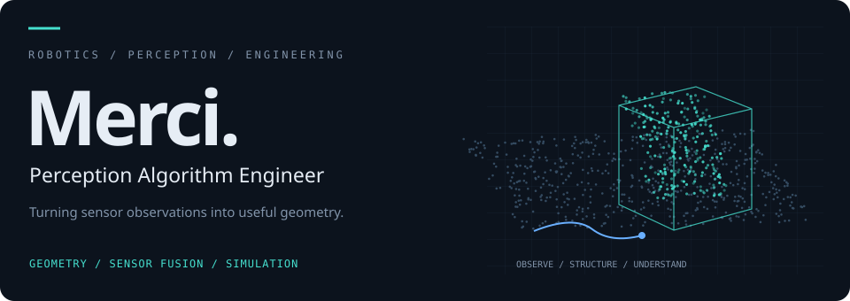

  

I work on perception-system design, implementation and deployment, turning imperfect observations into useful spatial understanding for robots.

Currently a **Perception Algorithm Engineer in consumer robotics**, working on multi-sensor perception systems led by stereo or LiDAR observations. My work spans framework co-design, geometric and semantic reasoning, temporal consistency and efficient C++ deployment.

M.Sc. in **Robotic Systems Engineering · RWTH Aachen University**.

### Selected work

- **[Stereo-led perception](https://hyandnn.github.io/projects/stereo.html)** — co-designed a multi-sensor perception framework spanning model post-processing, scene understanding and efficient deployment.
- **[LiDAR-led perception](https://hyandnn.github.io/projects/lidar.html)** — contributed to a production outdoor perception framework and its evolution across multiple robot platforms; led dynamic-target tracking integration.
- **[Collision-engine integration](https://hyandnn.github.io/projects/collision.html)** — extended broadphase, midphase and narrowphase queries in an existing engine, with geometry adaptation and interface integration.
- **[Video-based climbing analysis](https://hyandnn.github.io/projects/motion.html)** — designed and implemented a video-to-analysis pipeline connecting visual perception and spatial mapping to trajectory, velocity and joint-angle analysis.

**[Explore the portfolio and interactive illustrations](https://hyandnn.github.io)**

The portfolio explains project context, individual contributions, engineering decisions and limits. Its visuals are independent conceptual demonstrations using synthetic data.

**Toolkit:** C++ · Python · CMake · OpenCV · Point clouds · Collision detection

[Email](mailto:haoling.yang@rwth-aachen.de) · **Merci**
