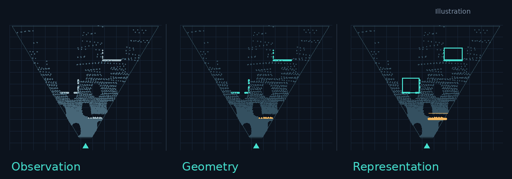
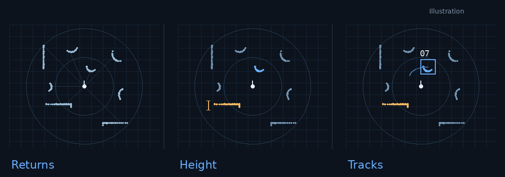
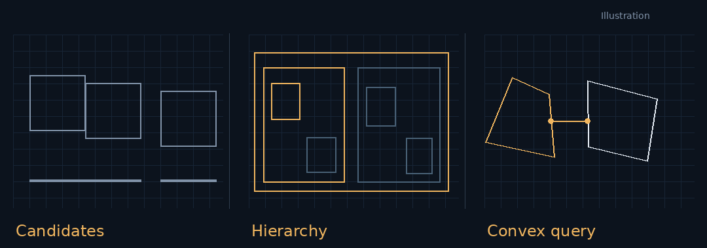
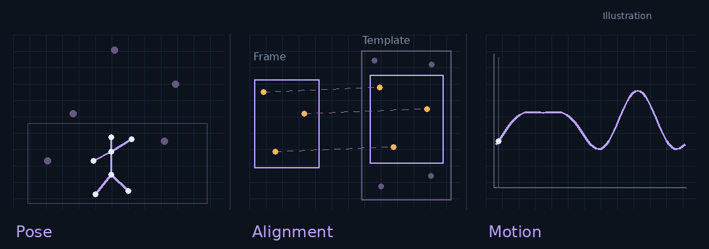

  

I build perception software that turns imperfect sensor observations into useful geometry for robots.

Currently a **Perception Algorithm Engineer in consumer robotics**, working on stereo-led and LiDAR-led perception with supporting IMU and odometry information. My work spans geometric reasoning, model post-processing, temporal consistency and efficient C++ implementation.

M.Sc. in **Robotic Systems Engineering · RWTH Aachen University**.

## Selected work

### 01 / Stereo perception
**Turning sparse observations into usable obstacle geometry.**

**Representative contribution:** addressed sparse depth observations of thin obstacles by combining geometric and semantic evidence to build a more useful obstacle representation.

Also introduced ground estimation, developed floor-surface post-processing, and adapted an existing geometric classification pipeline to stereo inputs with runtime optimizations.

### 02 / LiDAR perception
**Keeping moving targets consistent across observations.**

**Representative contribution:** led the introduction of object tracking into an established perception system to address the limits of static representations when people and other targets move through the scene.

Responsible for implementation and maintenance within the existing framework, including deployment fixes for height structure and overhanging obstacles. Supporting robot motion information helps interpret observations over time.

### 03 / Physics simulation
**Adding algorithm choices to an existing collision engine.**

**Representative contribution:** extended an existing engine with **Sweep and Prune**, a **BVH midphase** and **GJK**, adapting algorithms to its types, interfaces and data flow while preserving the original algorithm options.

### 04 / Vision-based motion analysis
**A common spatial reference despite camera movement.**

**Representative contribution:** aligned local video frames to a wall template using geometric features, establishing a common reference for trajectory and velocity analysis despite camera movement.

The master's research pipeline also combined hold detection and human pose estimation for movement and joint-angle analysis. Monocular depth ambiguity remains a limitation.

All animations are independently created conceptual illustrations using synthetic data. They do not show product recordings, internal implementations or measured research results.

## Engineering toolkit

| Implementation | Perception | Simulation |
| :--- | :--- | :--- |
| C++ · Python · CMake | OpenCV · Point clouds · Stereo vision | Collision detection · Spatial hierarchies |
| Profiling · Runtime optimization | Geometry + semantics · Tracking | Algorithm integration · Geometric queries |

Additional research: neural-network surrogate modeling for manufacturing simulation, with an interactive visualization interface.

---

[Email](mailto:haoling.yang@rwth-aachen.de) · **Merci**
